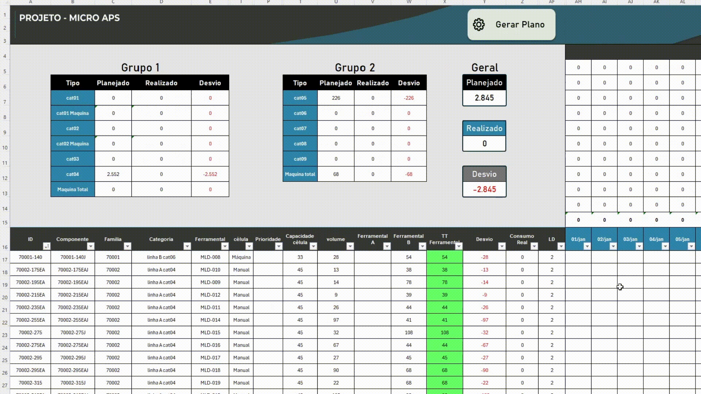
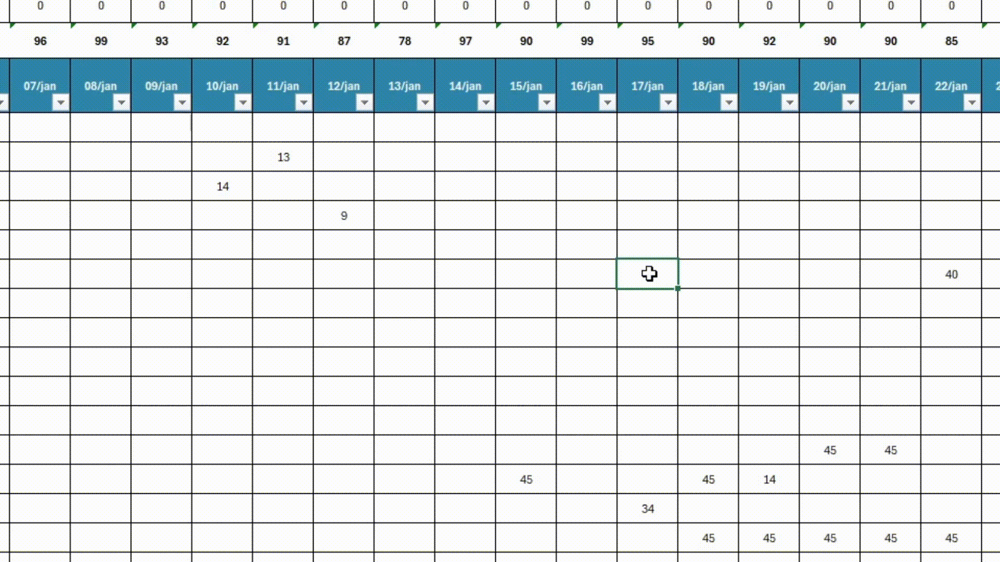

# ⚙️ Mini-APS — Sistema de Planejamento de Produção

Projeto de portfólio, dados fictícios — mas a lógica é real, nascida de um problema que enfrentei num ambiente industrial: distribuir um plano de produção sem virar um Tetris manual toda semana.

## 🎬 Demonstração

<!-- GIF: a macro rodando do início ao fim — plano "cru" → curva nivelando → resumo final -->

## 📌 O problema

Programar à mão sempre empilha os primeiros dias do calendário (é onde "cabe mais fácil" na hora), e quando um item não entrava no plano, ninguém sabia dizer o porquê sem investigar linha por linha.

## 🧠 Como funciona

🌊 **Valley-fill:** em vez de programar em ordem cronológica, o algoritmo sempre aloca no dia com menos carga no momento — recalculando a cada lote. Roda em duas passadas: nivelamento geral, depois pente-fino nas sobras.

🔮 **Moldes não são infinitos:** cada item "cura" por um tempo depois de produzido, ocupando o molde. Como a alocação pula de dia em dia, o sistema checa se o molde fica livre em *toda* a janela de cura à frente — não só no dia da alocação.

🎯 **Prioridade:** urgência manda mais que tudo; depois entra o gargalo — quanto menos molde disponível pro volume necessário, mais cedo o item é processado.

🟩 **Células verdes são sagradas:** ordens travadas manualmente na planilha são preservadas, descontadas da capacidade do dia, e o resto do plano se ajusta ao redor — nunca por cima.

<!-- Foto: uma célula verde travada com o plano se ajustando ao redor dela -->

🧾 **Quando algo não cabe, o sistema explica:** teto batido, falta de molde, categoria lotada — cada residual vem com o motivo anotado.

## 🧱 Regras de capacidade

*(Todas ao mesmo tempo — a mais apertada vence)*

🏭 Fábrica · ⚙️ Máquina · 📦 Categoria de produto (4 tipos) · 🔧 Moldes por item · 📏 Lote mínimo

## 🔄 Fluxo

`🟩 trava o fixo (se houver)` → `🌊 nivela o vale` → `📦 pente-fino` → `🧾 grava motivo` → `📊 resumo final`

## 🛠️ Stack

VBA puro, dentro do próprio Excel. Sem add-in, sem dependência externa.

---

📁 Projeto de portfólio, dados fictícios. Direitos reservados ao autor.

